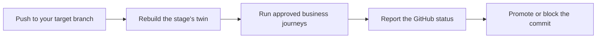

<p align="center">
  <picture>
    <source media="(prefers-color-scheme: dark)" srcset="public/assets/brand/perpetual-lockup-light.svg">
    
  </picture>
</p>

<p align="center"><b>The self-evolving CI/CD pipeline and testing platform.</b></p>

<p align="center">Repair broken builds, create test environments from your app, and make business journeys part of every release.</p>

<p align="center">
  <a href="#demo">Demo</a> ·
  <a href="#what-self-evolving-means">Vision</a> ·
  <a href="#quickstart">Quickstart</a> ·
  <a href="docs/README.md">Docs</a> ·
  <a href="ROADMAP.md">Roadmap</a> ·
  <a href="https://github.com/willlzl/Perpetual/discussions">Discussions</a>
</p>

<p align="center">
  <a href="LICENSE"></a>
  <a href="https://github.com/willlzl/Perpetual/actions/workflows/ci.yml"></a>
</p>

## Demo

**Watch the walkthrough · 2 min 56 sec**

https://github.com/user-attachments/assets/5e7a7941-2b9f-48b0-8aa1-dc7676b38960

Recorded in a simulated demo environment. Production deployment is a preview; see [Status](#status) for what is available today.

## Why Perpetual

Shipping a change means more than writing the code. Someone still has to repair the build, prepare a test environment, check that the feature works, and make sure existing user journeys still work too. As a product grows, that work grows with it.

A green build can still ship a broken checkout. Tests with fixed mock responses can miss failures across authentication, billing and application state. Manual testing catches some of those gaps, but makes every release depend on someone repeating the same work.

**Testing belongs inside the delivery pipeline. Its results should decide whether a change moves forward.**

Perpetual brings build repair, test environments, business testing and promotion gates into one workflow. It works with GitHub Actions and your existing deployment workflows, connecting the question “does it build?” to “does the product still work for its users?”

## What self-evolving means

The goal is a pipeline that can recover from failures, reduce delivery time, and keep its tests useful as the product changes. The **0.1 alpha** starts with build repair and business-journey gates.

| Capability | What it means | Available today and planned |
| --- | --- | --- |
| **Self-healing** | Recover from delivery failures through verified fixes. | **Today:** repair failed builds through pull requests, with CI and journey gates before automatic merge. **Planned:** merge-conflict resolution, deployment repair, pipeline snapshots and production rollback. |
| **Self-improving** | Reduce the time and work needed to ship as a project grows. | **Planned:** change-aware incremental testing, build and deployment optimization, and dependency upgrades that also fix affected application code. |
| **Self-testing** | Create stateful test environments and exercise complete business scenarios. | **Today:** application twins, AI-drafted journeys, live browser runs, recordings and approved tests as CI/CD gates. **Planned:** learn from failures to expand scenario coverage and propose repairs to outdated test code. |

See the [roadmap](ROADMAP.md) for the next implementation steps.

## How it works today



1. **Connect your repository and branch.** Perpetual shows your GitHub Actions workflows and configured deployment targets in one pipeline.
2. **Create a Beta environment.** Perpetual builds a Docker Compose twin from your application's code, with stateful dependencies, fixtures and test accounts. Add another Sandbox stage, such as Gamma, when you need another gate.
3. **Discover and review business journeys.** An agent explores the running app and drafts complete scenarios. You can add your own cases and edit their goals, prerequisites and expected outcomes. For example: *sign in → create a workflow → save and reopen it → run it → see the result and credits deducted*.
4. **Turn those journeys into a release gate.** Generate, verify and approve their Playwright code. On each new push to the target branch, Perpetual rebuilds the twin at that commit and runs the approved tests. Watch the browser live and inspect the recordings afterward. A failed journey blocks promotion; a blocked or needs-review result requires a manual release; a pass advances to the next Sandbox stage.
5. **Repair failed builds through a PR.** For eligible build failures, an agent works in an isolated Docker repair box and opens a fix. Build's **Autopilot** can merge after CI and every configured Sandbox journey gate pass at the exact PR head, provided no change rule holds it. Choose **Ask first** to keep the merge decision with you.

Perpetual waits for the commit's reported GitHub Actions builds before running Sandbox gates, then posts a `perpetual/<Stage>` GitHub commit status. Require it when promoting into a protected release branch, or have your deployment workflow check it. The optional **Deploy** action requests the tested commit through a repository-owned GitHub deployment handler and follows its real status. [Gate configuration →](docs/gate.md#requiring-the-status-on-github) · [Deployment setup and limits →](docs/releases.md)

## Test the application and its dependencies together

A twin runs your application's actual code against working services with test data. A journey keeps its session and business state across steps, so it can exercise the interaction between your UI, backend and dependencies.

Official local modes and sandboxes come first. Where a vendor has none, Perpetual uses [vercel-labs/emulate](https://github.com/vercel-labs/emulate). It records each dependency's source on the environment; an unsupported integration or missing test account stays an explicit blocker.

| Dependency | What the twin uses |
| --- | --- |
| PostgreSQL, MongoDB, Redis | Actual databases and cache |
| Supabase | Official local stack, including Auth and database |
| Stripe | Official sandbox, fixtures and webhook forwarding; Perpetual can create a sandbox on request |
| Trigger.dev | Self-hosted instance with a project and worker for the twin |
| Email | Mailpit |
| AI features | A real model through OpenRouter |
| GitHub, Google, AWS, Linear, Vercel API, Sign in with Apple | `vercel-labs/emulate` |

Twins use test credentials and fixtures, not copies of production customer data. A working environment alone is never a passing test: the journey's reviewed checks must observe its business outcome. [Twin setup and supported services →](docs/twins.md)

## Quickstart

You need **Node.js 24.12+**, **Docker** for build repair and **Docker Desktop** for twins (twins do not work on a native Linux engine), the **GitHub CLI**, and **[uv](https://docs.astral.sh/uv/)**. Setup installs the project dependencies, interface, Chromium and browser runtime, and reports missing prerequisites.

```sh
git clone https://github.com/willlzl/Perpetual.git && cd Perpetual
npm run setup
node src/cli.ts serve --repo /path/to/your/app
```

Then open the link it prints, `http://127.0.0.1:4317/#secret=…`, which signs your browser in:

1. **Settings**: add an [OpenRouter API key](https://openrouter.ai/keys).
2. **Connect GitHub** and choose the repository and target branch. The gate watches repositories chosen this way.
3. Add **Beta**, choose **Create Beta environment**, and connect any requested test services or accounts.
4. Review the drafted journeys, then **Generate code**, **Verify code** and **Approve code**. Approval requires three passing runs and a control run whose blocked writes cause a reviewed check to fail.
5. Push a new commit to the target branch while the controller is running. Use its `perpetual/Beta` status to gate release-branch promotion or deployment.

To update Perpetual, run `git pull` and then `npm run setup` again in the clone before restarting it: `serve` serves the interface as setup last built it.

<details>
<summary>Let your coding agent guide setup</summary>

Paste this into your coding agent in the repository you want tested:

```text
Set up Perpetual (https://github.com/willlzl/Perpetual) for this repository: clone it outside this repository, run `npm run setup` in the clone and install anything it reports missing, then follow the clone's docs/onboarding.md with me, asking me its questions one at a time. Leave this repository unchanged, and ask me before you enter an API key or sign in anywhere.
```

</details>

## Status

> [!NOTE]
> Perpetual is a **0.1 alpha** for web applications. The controller runs locally, watches one active repository and branch, and uses Docker Compose for application twins.

- **You review the tests.** AI writes twin configurations, drafts journeys and code, and proposes build repairs. Only reviewed journeys with approved code run automatically in the gate.
- **Approved tests replay without an agent.** Runs execute approved Playwright code with independent browser checks and no automatic retries. API and database checks are planned. Test execution uses no model; AI features inside your application can still use one.
- **You control the environment.** The controller binds to localhost and polls GitHub while running. Hosted twins, a GitHub App and webhooks are not available yet. The desktop sandbox is experimental.
- **Deployment needs a configured handler.** Manual deployment requests are available through GitHub; your workflow deploys the exact tested commit and reports the result. This channel still needs end-to-end cloud acceptance. Existing provider autodeploy must be gated separately.
- **The full vision is still being built.** Pipeline optimization, dependency upgrades, test-code repair, automatic deployment after gates and production rollback are planned.

[Journey approval and verification →](docs/journeys.md#journey-code) · [Build repair and its limits →](docs/repair.md) · [Changelog →](CHANGELOG.md)

## Why we're building it

I started Perpetual after 4+ years as a software engineer at Amazon and more than 20 freelance projects. I kept spending time maintaining delivery pipelines, fixing failed builds, preparing test environments and manually checking releases.

One production incident made the gap clear: mocked integration tests missed a broken business scenario, and getting the fix through the pipeline took hours. In my freelance work, skipping pipeline setup simply moved that effort into manual checks before every release.

Perpetual's goal is to make a reliable delivery pipeline practical to set up and keep running as a product grows.

## Documentation

- [Pipeline](docs/pipeline-ui.md): the stages, Build and Production, branches and the Git graph
- [Twins](docs/twins.md): how a twin is built and which services it supports
- [Journeys](docs/journeys.md): discovery, review, journey code and its verification, runs and recordings
- [CI/CD gate](docs/gate.md): commit statuses, release and branch protection
- [Build repair](docs/repair.md): the agent's box, its change rules, the pull request, the journey gates at its head and the merge
- [Providers](docs/providers.md): GitHub, Vercel and Railway connections
- [CLI](docs/cli.md) and the experimental [desktop sandbox](docs/desktop-sandbox.md)
- [Architecture](docs/README.md#architecture), [decision records](docs/adr/README.md) and the [glossary](CONTEXT.md)

## Open source and Cloud

Run the current open-source alpha on your own machine under the AGPL. A hosted version with subscription and usage-based pricing is planned.

## Community

- [Discussions](https://github.com/willlzl/Perpetual/discussions) for questions and ideas
- [Issues](https://github.com/willlzl/Perpetual/issues) for bugs
- [SECURITY.md](SECURITY.md) for reporting vulnerabilities privately

## Contributing

Contributions are welcome; start with [CONTRIBUTING.md](CONTRIBUTING.md) and the `good first issue` label. First-time contributors sign the [CLA](CLA.md) once by commenting on their pull request. Coding agents should read [AGENTS.md](AGENTS.md).

## License

Perpetual is licensed under the [GNU Affero General Public License v3.0 only](LICENSE) (`AGPL-3.0-only`).

- Running Perpetual unmodified, on your machine, in your CI or inside your organization, requires nothing further.
- If you modify Perpetual and let users interact with your modified version over a network, such as a hosted service, you must offer those users its complete corresponding source under the same license (section 13).
- The Perpetual name and logos are not licensed under the AGPL; see [TRADEMARKS.md](TRADEMARKS.md). Third-party components keep their own licenses; see [docs/ASSETS.md](docs/ASSETS.md) and [NOTICE](NOTICE).
